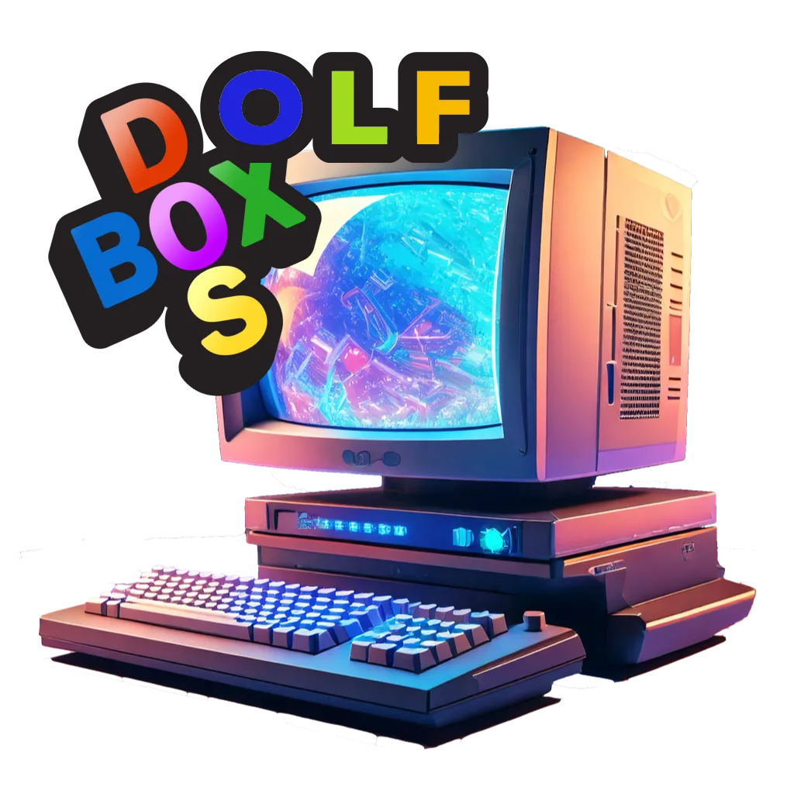

# DOLF



Dosbox-X (MS-DOS) for Wolf, v0.3

## Why?
I want to be able to run my MS-DOS discs (Games!) inside Wolf, e.g., to directly jump into the command line and have a GUI to switch images etc.
Also Dosbox-X is not available in Retroarch but provides much more functionality then the original Dosbox, like the GUI.

## What is it?
This projects provides a dosbox-x docker image to be used by the amazing Wolf project.

Using this you will get a you virtual PC with:
- A 486 DX2 CPU on 66 MHZ (tweakable)
- 16 MB of RAM (608KB EMS memory)
- A 2GB (!) HDD as C:
- MS-DOS 5
- S3 Trio Graphics Adapter
- CD-ROM Drive(s) + driver
- Mouse Driver
- Creative Labs Soundblaster 16 sound card at IRQ 7, DMA 5

So, an amazing gaming PC on the level of year 1993

## Quickstart

Dolf tries to make you start of MS-DOS in Wolf as easy as possible. 
If you are missing images of your games/applications, you either have to create image files from the 
installation discs you still have, or can maybe find them at a location like archive.org.

### 1. Edit Wolf Config file
```toml
[[apps]]
start_virtual_compositor = true
title = 'DosBox'
    [apps.runner]
    base_create_json = '''{
        "HostConfig": {
            "IpcMode": "host",
            "CapAdd": ["NET_RAW", "MKNOD"],
            "Privileged": false,
            "DeviceCgroupRules": ["c 13:* rmw", "c 244:* rmw"]
        }
    }
'''
    devices = []
    env = [ 'RUN_SWAY=true', 'GOW_REQUIRED_DEVICES=/dev/input/* /dev/dri/*',  'KEYBOARDLAYOUT=de', 'XKB_DEFAULT_LAYOUT=de' ]
    image = 'dosbox-image'
    mounts = [ '/storage/storagefs/wolf/data/dosbox:/opt/dosbox:rw' ]
    name = 'Dolf'
    ports = []
    type = 'docker'
```

### 2. Start Image again
After the first reboot of the install leave the session by entering exit into dosbox window.
After routines run through, you maybe face a blocked moonlight session. If that's the case, just quit and start the session again.

## Developer Guide
1. clone the repository

2. build the image
docker build -t dolf-image .

3. Config Wolf for DOS Games
edit your wolf config.toml

4. Modify the sources as you wish

5. Start Moonlight to test it

## Roadmap

### v0.5
 - [ ] Dolf listed in Wildlife as Community APP

### v0.4
 - [x] Decision to separate Win3.11 and Win98SE to separate projects, to have a stable and simple env for MS-DOS
 - [ ] Extending Documentation
 - [x] Generation of Logo
 - [ ] Generation of Screenshot

### v0.3
 - [x] Testing by playing (tested Ascendancy and Warcaraft II ... much too long ... lost focus ...

### v0.2
- [x] Being able to start Dolf in Wolf and running games

### v0.1
- [x] Latest DosBox-X in a Docker Container
- [x] Configuration for a 1993 machine

## FAQ
Answers to some basic questions
### My Game does not find the CD even when I mounted it, what can I do?
During installation many MS-DOS games store the drive letter as a fixed constant, that means you have to ensure you have to mount the games CD exactly on the same drive letter you used during installation.

### How can I exit MS-DOS?
You have 3 options:
- Disconnect from the session by using the Moonlight Keyboard Combo
- Type in "exit" on the command line
- Use the DOSBOX GUI to quit the session


## License
Copyright 2025 Niklas Stephan

Permission is hereby granted, free of charge, to any person obtaining a copy of this software and associated documentation files (the “Software”), to deal in the Software without restriction, including without limitation the rights to use, copy, modify, merge, publish, distribute, sublicense, and/or sell copies of the Software, and to permit persons to whom the Software is furnished to do so, subject to the following conditions:

The above copyright notice and this permission notice shall be included in all copies or substantial portions of the Software.

THE SOFTWARE IS PROVIDED “AS IS”, WITHOUT WARRANTY OF ANY KIND, EXPRESS OR IMPLIED, INCLUDING BUT NOT LIMITED TO THE WARRANTIES OF MERCHANTABILITY, FITNESS FOR A PARTICULAR PURPOSE AND NONINFRINGEMENT. IN NO EVENT SHALL THE AUTHORS OR COPYRIGHT HOLDERS BE LIABLE FOR ANY CLAIM, DAMAGES OR OTHER LIABILITY, WHETHER IN AN ACTION OF CONTRACT, TORT OR OTHERWISE, ARISING FROM, OUT OF OR IN CONNECTION WITH THE SOFTWARE OR THE USE OR OTHER DEALINGS IN THE SOFTWARE.
